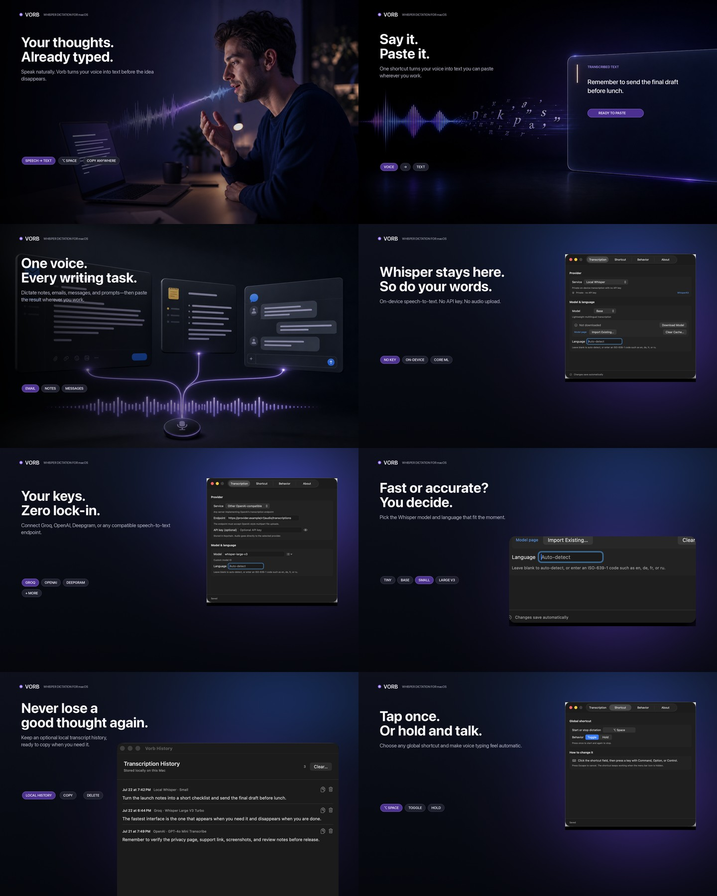

# Vorb

Native macOS push-to-talk dictation. Use the default **Option–Space** shortcut—or record your own—then toggle recording or hold the shortcut while speaking. Vorb transcribes locally or through your chosen provider and can paste, copy, and retain a local history.

[Website](https://vorb.shulmnn.com) · [Privacy](https://vorb.shulmnn.com/privacy) · [Support](https://vorb.shulmnn.com/support) · [Report an issue](https://github.com/shulmnn/vorb/issues)



Vorb is a SwiftUI/AppKit menu-bar app with no account or application backend. Provider API keys live in macOS Keychain, and recorded audio goes directly from your Mac to the selected transcription endpoint.

## Features

- Configurable global shortcut with toggle-to-speak and hold-to-speak modes
- Minimal floating particle orb that reacts to microphone input
- Optional detailed overlay with status text and shortcut guidance
- The Thinking Orbs **Solving** state as the app icon
- Keyless on-device Whisper through native Swift and Core ML
- 20 provider modes spanning local, hosted, routed, self-hosted, and custom APIs
- Editable model IDs with provider-specific recommended-model menus
- Editable deployment URLs for Azure, Cloudflare, and local servers
- Multilingual auto-detection or an explicit ISO-639-1 language code
- Settings save automatically; provider keys are written to Keychain after editing
- Independent automatic-paste and copy-to-clipboard controls
- Clipboard restoration when paste is on and copying is off
- Optional local transcription history with copy, delete, and clear controls
- A hideable menu-bar icon; the global shortcut continues working
- Separate Keychain storage for every provider; local servers can run without a key
- No analytics or JavaScript runtime

## Providers

The catalog stays lightweight: it is native URLSession code with no provider SDKs or application backend.

| Type | Built-in providers |
| --- | --- |
| On-device | Local Whisper via WhisperKit; models download only when the user clicks Download Model |
| Hosted and routed | Groq, OpenAI, OpenRouter, Mistral, Together AI, DeepInfra, SiliconFlow, Scaleway, OVHcloud AI Endpoints, Deepgram, ElevenLabs, Hugging Face Inference, Cloudflare Workers AI, Azure OpenAI |
| Self-hosted | LocalAI, Speaches, NVIDIA Speech NIM, WhisperLiveKit |
| Escape hatch | Any OpenAI-compatible `/audio/transcriptions` endpoint |

OpenRouter exposes a changing catalog of STT models behind one key, while Hugging Face Inference can route compatible ASR models through its inference providers. Model IDs remain editable so the app does not need a release whenever a provider adds a model.

## Requirements

- macOS 14 or newer
- Swift 6 toolchain or Xcode 16+
- A key from your chosen hosted provider, a reachable self-hosted transcription server, or Apple silicon for Local Whisper

Local Whisper never starts a model download during dictation. Choose a model in Settings and click **Download Model** first, or use **Import Existing** to select a complete WhisperKit model folder or repository already on your Mac. Vorb can reveal an installed model in Finder, remove the selected model, or clear every downloaded and partial model file.

## Build and run

```sh
chmod +x Scripts/package_app.sh
./Scripts/package_app.sh
open dist/Vorb.app
```

The default package is ad-hoc signed for local development. To create a hardened direct-download build, pass a signing identity—for public distribution, use a `Developer ID Application` certificate:

```sh
DIRECT_SIGNING_IDENTITY="Developer ID Application: COMPANY (TEAMID)" \
./Scripts/package_app.sh
```

On first use, macOS asks for microphone permission. In the direct-download build, automatic paste also requires Vorb in **System Settings → Privacy & Security → Accessibility**. Copying and local history do not require Accessibility access. The sandboxed Mac App Store build copies text instead of controlling another app.

If you hide the menu-bar icon, the configured global shortcut keeps working. Reopen `Vorb.app` from Finder or Spotlight to show Settings again.

## How it works

1. The app records 16 kHz mono WAV audio locally.
2. When you stop, Local Whisper transcribes on-device; other providers receive one direct request. Most use OpenAI-compatible multipart, while OpenRouter, Deepgram, Hugging Face, and Cloudflare use their documented native request shape.
3. The provider returns the transcript as JSON.
4. Depending on Settings, Vorb pastes it, copies it, and/or stores it locally.
5. The temporary audio file is deleted after the request completes.

Useful API references: [OpenAI](https://developers.openai.com/api/docs/guides/speech-to-text), [OpenRouter](https://openrouter.ai/docs/guides/overview/multimodal/stt), [Mistral](https://docs.mistral.ai/api/endpoint/audio/transcriptions), [Together](https://docs.together.ai/docs/inference/transcription/overview), [DeepInfra](https://docs.deepinfra.com/api-reference/audio/openai-audio-transcriptions), [SiliconFlow](https://docs.siliconflow.com/en/api-reference/audio/create-audio-transcriptions), [Scaleway](https://www.scaleway.com/en/developers/api/generative-apis/audio), [OVHcloud](https://docs.ovhcloud.com/en/guides/public-cloud/ai-machine-learning/ai-endpoints-audio-models), [Deepgram](https://developers.deepgram.com/docs/pre-recorded-audio), [ElevenLabs](https://elevenlabs.io/docs/api-reference/speech-to-text/convert), [Hugging Face](https://huggingface.co/docs/inference-providers/tasks/automatic-speech-recognition), and [Cloudflare](https://developers.cloudflare.com/workers-ai/models/whisper/).

A custom provider must accept OpenAI-style `file`, `model`, `response_format`, optional `language`, and `temperature` multipart fields. The built-in catalog intentionally focuses on synchronous record-to-response APIs; upload-and-poll job services would add background job state to an otherwise small push-to-talk app.

## Privacy and security

- API keys are stored as generic passwords in macOS Keychain and are never written to preferences or source files.
- Temporary recordings are removed after transcription, including failed requests.
- History is optional and stored in Vorb’s Application Support directory.
- Local Whisper models are downloaded only after an explicit click and stored in Vorb’s Application Support directory; local audio never leaves the Mac.
- There is no telemetry or application server.
- Audio and provider-side retention are governed by the selected provider’s policies.

## Development

```sh
env DEVELOPER_DIR=/Applications/Xcode.app/Contents/Developer swift test
env DEVELOPER_DIR=/Applications/Xcode.app/Contents/Developer swift build
```

Cloud transcription uses native URLSession code without provider SDKs. On-device transcription uses the MIT-licensed [WhisperKit](https://github.com/argmaxinc/argmax-oss-swift) Core ML runtime. The orb renderer is native SwiftUI `Canvas` code, visually inspired by Jakub Antalik’s MIT-licensed [Thinking Orbs](https://github.com/Jakubantalik/thinking-orbs). The Solving icon is rendered from that library’s engine. See [THIRD_PARTY_NOTICES.md](THIRD_PARTY_NOTICES.md).

## Mac App Store

Vorb has a separate sandboxed build that keeps Local Whisper, provider access, clipboard copy, history, and the global shortcut. App Sandbox does not permit cross-app Accessibility automation, so the Store build copies the transcript and leaves automatic paste to the direct-download build.

See [APP_STORE_RELEASE.md](APP_STORE_RELEASE.md) for signing, packaging, review notes, and the remaining App Store Connect prerequisites. The release package script is intentionally parameterized so certificates and provisioning profiles never enter the repository.

## Support

For questions or help, visit [Vorb Support](https://vorb.shulmnn.com/support), open a [GitHub issue](https://github.com/shulmnn/vorb/issues), or email [support@amnios-group.com](mailto:support@amnios-group.com). Security reports should follow [SECURITY.md](SECURITY.md).

Contributions and noncommercial forks are welcome. Start with [CONTRIBUTING.md](CONTRIBUTING.md).

## License

Vorb is source-available under the [PolyForm Noncommercial License 1.0.0](LICENSE). You may use, study, modify, and distribute it for permitted noncommercial purposes. Commercial use—including selling the app or a monetized derivative—requires separate permission from Amnios Group.

Third-party components remain under their respective licenses; see [THIRD_PARTY_NOTICES.md](THIRD_PARTY_NOTICES.md).
